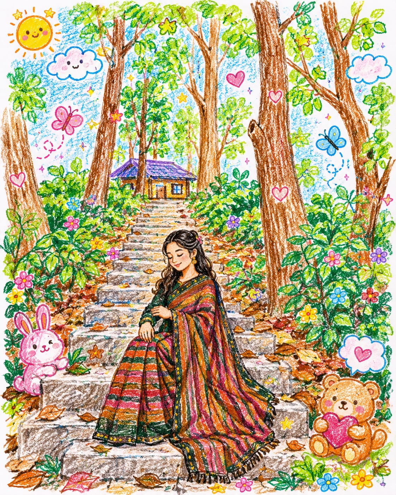
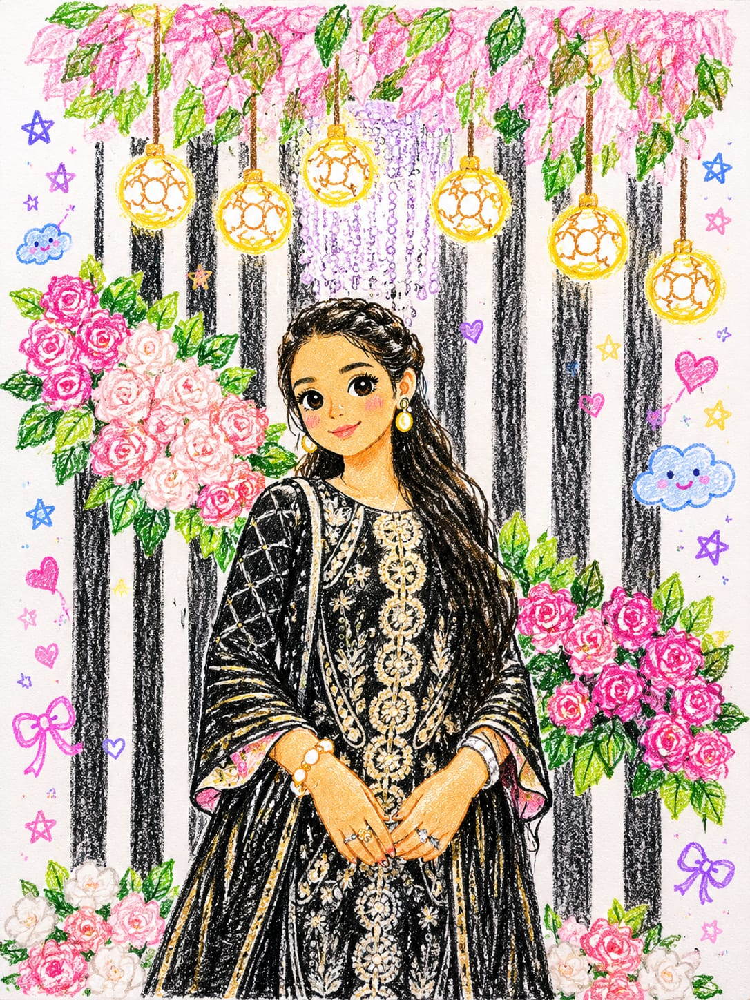
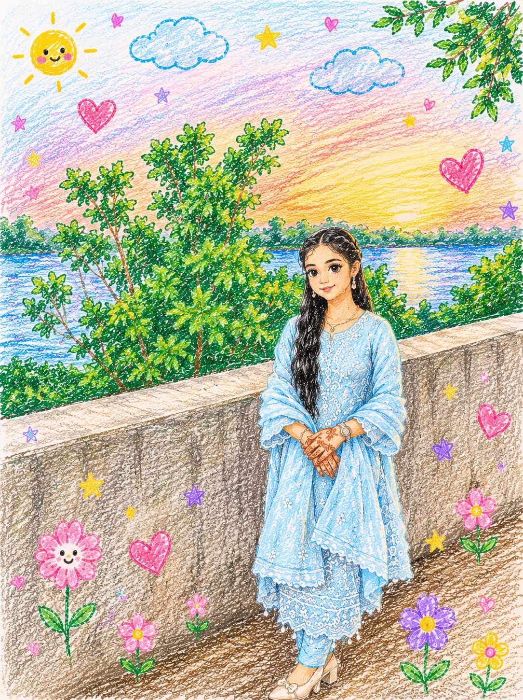

<!DOCTYPE html>
<html lang="en">
<head>

<meta charset="UTF-8">
<meta name="viewport" content="width=device-width, initial-scale=1.0">

<title>Happy Birthday</title>

<link href="https://fonts.googleapis.com/css2?family=Great+Vibes&family=Poppins:wght@300;400;500;600&display=swap" rel="stylesheet">

</head>

<body>

    

        

    

    

        

    

    <button id="openBtn">
        Click for Surprise ✨
    </button>

    

        <a href="#home">Home</a>
        <a href="#message">Messages</a>
        <a href="#wish">Wishes</a>
    

    <audio id="music" loop preload="auto">
        <source src="her2.mp3" type="audio/mp3">
    </audio>

    
🎂

    
🎈

    
💙

    
🦋

    
🎉

    
✨

    <section id="home">
        
🎂

        
👑

        
🎈

        

            

                <h1 class="title">Happy   Birthday</h1>
                
𝑺𝒂𝒅𝒊𝒂 𝑰𝒔𝒓𝒂𝒕‪‪❤︎‬ <small><i>Faitytale</i></small>

                
Scroll For Next Page ↓

            

            

                
                
💙

                
🤍

                
🩵

            

        

    </section>

    <section id="message">
        
🎂

        
👑

        
💖

        
✨

        

            

                

                    𝑯𝒊𝒊! 
𝑯𝒂𝒑𝒑𝒚 𝑩𝒊𝒓𝒕𝒉𝒅𝒂𝒚 𝑺𝒂𝒅𝒊𝒂...  

𝑫𝒐 𝒚𝒐𝒖 𝒌𝒏𝒐𝒘 𝒕𝒉𝒂𝒕 𝒐𝒏 𝒕𝒉𝒊𝒔 𝒅𝒂𝒚 𝒊𝒏 𝟐𝟎𝟎𝟖, 𝒂 𝒃𝒆𝒂𝒖𝒕𝒊𝒇𝒖𝒍 𝒍𝒊𝒕𝒕𝒍𝒆 𝒈𝒊𝒓𝒍 𝒘𝒂𝒔 𝒃𝒐𝒓𝒏 𝒊𝒏𝒕𝒐 𝒕𝒉𝒊𝒔 𝒘𝒐𝒓𝒍𝒅...  

𝑰 𝒘𝒂𝒔𝒏'𝒕 𝒕𝒉𝒆𝒓𝒆, 𝒃𝒖𝒕 𝑰 𝒕𝒉𝒊𝒏𝒌 𝒕𝒉𝒆 𝒘𝒉𝒐𝒍𝒆 𝒉𝒐𝒔𝒑𝒊𝒕𝒂𝒍 𝒎𝒖𝒔𝒕 𝒉𝒂𝒗𝒆 𝒔𝒉𝒐𝒏𝒆 𝒘𝒊𝒕𝒉 𝒍𝒊𝒈𝒉𝒕, 𝒃𝒆𝒄𝒂𝒖𝒔𝒆 𝒚𝒐𝒖 𝒃𝒓𝒐𝒖𝒈𝒉𝒕 𝒉𝒂𝒑𝒑𝒊𝒏𝒆𝒔𝒔 𝒂𝒏𝒅 𝒍𝒊𝒈𝒉𝒕 𝒘𝒊𝒕𝒉 𝒚𝒐𝒖.‪‪❤︎‬
                

                

                    
                

            

            
            

                

                    
                

                

                    𝑯𝒂𝒑𝒑𝒚 𝑩𝒊𝒓𝒕𝒉𝒅𝒂𝒚, 𝑰𝒔𝒓𝒂𝒕!  

𝑻𝒉𝒂𝒏𝒌 𝒚𝒐𝒖 𝒇𝒐𝒓 𝒂𝒍𝒍 𝒕𝒉𝒆 𝒎𝒆𝒎𝒐𝒓𝒊𝒆𝒔, 𝒍𝒂𝒖𝒈𝒉𝒕𝒆𝒓, 𝒂𝒏𝒅 𝒎𝒐𝒎𝒆𝒏𝒕𝒔 𝒘𝒆'𝒗𝒆 𝒔𝒉𝒂𝒓𝒆𝒅.
𝒀𝒐𝒖 𝒎𝒂𝒌𝒆 𝒍𝒊𝒇𝒆 𝒃𝒓𝒊𝒈𝒉𝒕𝒆𝒓 𝒋𝒖𝒔𝒕 𝒃𝒚 𝒃𝒆𝒊𝒏𝒈 𝒚𝒐𝒖𝒓𝒔𝒆𝒍𝒇.  

𝑴𝒂𝒚 𝒕𝒉𝒊𝒔 𝒚𝒆𝒂𝒓 𝒃𝒓𝒊𝒏𝒈 𝒚𝒐𝒖 𝒆𝒏𝒅𝒍𝒆𝒔𝒔 𝒋𝒐𝒚, 𝒔𝒖𝒄𝒄𝒆𝒔𝒔, 𝒂𝒏𝒅 𝒆𝒗𝒆𝒓𝒚𝒕𝒉𝒊𝒏𝒈 𝒚𝒐𝒖𝒓 𝒉𝒆𝒂𝒓𝒕 𝒅𝒆𝒔𝒊𝒓𝒆𝒔.‪‪❤︎‬
                

            

            
            

                Scroll For Final Page ↓
            

        

    </section>

    <section id="wish">
        

        
        
🎂

        
🎈

        
✨

        
💙

        

            
One Wish

            
<small>
𝑰 𝑾𝑰𝑺𝑯 𝒀𝑶𝑼 𝑮𝑬𝑻 𝑬𝑽𝑬𝑹𝒀𝑻𝑯𝑰𝑵𝑮 𝒀𝑶𝑼'𝑽𝑬 𝑬𝑽𝑬𝑹 𝑾𝑰𝑺𝑯𝑬𝑫 𝑭𝑶𝑹....  

𝑰 𝑾𝑰𝑺𝑯 𝒀𝑶𝑼 𝑵𝑬𝑽𝑬𝑹 𝑭𝑶𝑹𝑮𝑬𝑻 𝑴𝑬, 𝑵𝑶 𝑴𝑨𝑻𝑻𝑬𝑹 𝑾𝑯𝑬𝑹𝑬 𝑳𝑰𝑭𝑬 𝑻𝑨𝑲𝑬𝑺 𝑼𝑺....  

𝑰 𝑾𝑰𝑺𝑯 𝑾𝑬 𝑪𝑶𝑼𝑳𝑫 𝑩𝑬 𝑪𝑳𝑨𝑺𝑺𝑴𝑨𝑻𝑬𝑺 𝑶𝑵𝑪𝑬 𝑨𝑮𝑨𝑰𝑵 𝑨𝑵𝑫 𝑹𝑬𝑳𝑰𝑽𝑬 𝑻𝑯𝑶𝑺𝑬 𝑩𝑬𝑨𝑼𝑻𝑰𝑭𝑼𝑳 𝑴𝑬𝑴𝑶𝑹𝑰𝑬𝑺....  

𝑰 𝑾𝑰𝑺𝑯 𝑻𝑯𝑬 𝑨𝑮𝑬 𝑮𝑨𝑷 𝑩𝑬𝑻𝑾𝑬𝑬𝑵 𝑼𝑺 𝑫𝑰𝑫𝑵'𝑻 𝑬𝑿𝑰𝑺𝑻....  

𝑰 𝑾𝑰𝑺𝑯 𝑰 𝑪𝑶𝑼𝑳𝑫 𝑻𝑬𝑳𝑳 𝒀𝑶𝑼 𝑬𝑽𝑬𝑹𝒀𝑻𝑯𝑰𝑵𝑮 𝑰'𝑽𝑬 𝑨𝑳𝑾𝑨𝒀𝑺 𝑾𝑨𝑵𝑻𝑬𝑫 𝑻𝑶 𝑺𝑨𝒀....  

𝑨𝑵𝑫 𝑨𝑩𝑶𝑽𝑬 𝑨𝑳𝑳, 𝑰 𝑾𝑰𝑺𝑯 𝒀𝑶𝑼 𝑨 𝑳𝑰𝑭𝑬 𝑭𝑰𝑳𝑳𝑬𝑫 𝑾𝑰𝑻𝑯 𝑯𝑨𝑷𝑷𝑰𝑵𝑬𝑺𝑺, 𝑳𝑶𝑽𝑬, 𝑨𝑵𝑫 𝑬𝑵𝑫𝑳𝑬𝑺𝑺 𝑹𝑬𝑨𝑺𝑶𝑵𝑺 𝑻𝑶 𝑺𝑴𝑰𝑳𝑬....  

𝑶𝑵𝑪𝑬 𝑨𝑮𝑨𝑰𝑵, 𝑯𝑨𝑷𝑷𝒀 𝑩𝑰𝑹𝑻𝑯𝑫𝑨𝒀, 𝑴𝒚 𝒍𝒐𝒗𝒆 𝒂𝒕 𝒇𝒊𝒓𝒔𝒕 𝒔𝒊𝒈𝒉𝒕....❤️</small>
            

        

    </section>

</body>
</html>
